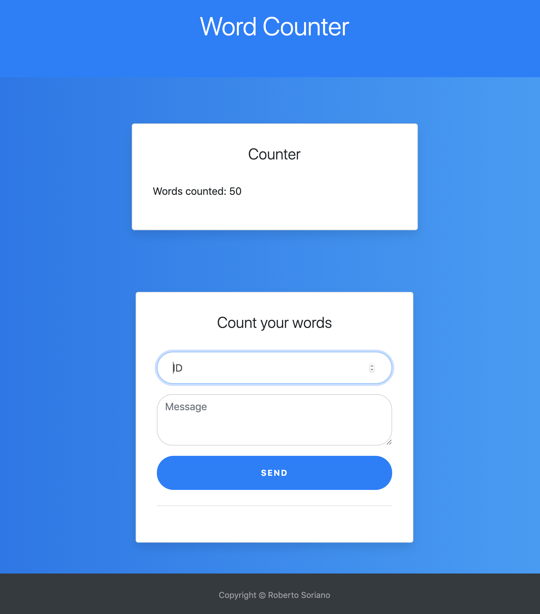

# Word Counter

Word counter using ExpressJS and MongoDB. Provides a RESTful API endpoint, that POST requests with a json message with two fields: "id" and "message". For example: (example: { "id": "123", "message": "hello world" }) or simply { "id": "123", "message": "hello world" }. If the request is valid, words in the message area counted and added to the (historical) count. Server check for valid request bodies and doesn't count request with ids that have been used already.
<br/>

A [front-end UI](https://counter.robertmsoriano.com) has also been added, to allow users to submit requests from their browser. 



### Project's requirements
This project is the result of a coding assignment from LifeWay Christian Resources. Here are the requirements:

1. Create a REST service with a single endpoint that accepts a json message with two fields.."id" and "message". (example: { "id": "123", "message": "hello world" })
2. The endpoint should return a json document with a single field "count" that contains the total number of words contained in all the messages received to that point.
For example, if the first message contains 3 words it would responsd with count = 3. If the next message contains 5 words it would respond with count = 8.
3. The service should ignore messages with duplicate ids. (i.e. ids that have already been processed)
4. Use the programming language of your choice.
5. Upload all code to a public github repo with a readme that explains how to build and run the project

Following are the instructions on how to build and run the project. 

## Get Started

These instructions will get you a copy of the project up and running on your local machine for development purposes. See deployment for notes on how to deploy the project on a live system, e.g. Heroku, Docker.

### Prerequisites

This Projects requires NodeJS and MongoDB. We will also use NPM for package management. 
> MongoDB will be connected using [MongooseJS](https://mongoosejs.com/).
> You may signup for a free Cloud [MongoDB](https://www.mongodb.com/cloud) instance, or run your own locally.

* [NodeJS](https://nodejs.org/)
* [MongoDB](https://www.mongodb.com/)
* [NPM](https://www.npmjs.com/)


### Installing

Clone or download this GitHub repository

```
git clone https://github.com/robertomsoriano/word-counter.git
```
Project Directory
```
word-counter
└───static
│   │   index.css
│   │   index.js
└───views
│   └───pages
│       │   index.ejs
|   .gitignore
|   app.json  //For Heroku
│   LICENSE
|   package.json
│   README.md
|   routes.js
|   Schema.js
|   server.js

After npm install, you should see the node_modules dir. Keep reading for instructions on .env file to be added as well. 
```

Install dependencies using NPM.

```
cd word-counter/
npm install 
```
Add .env file with MONGO_URI and NODE_ENV environment variables. 
> [MongooseJS](https://mongoosejs.com/) will use the MONGO_URI to connect to your MongoDB instance. <br/>
> NODE_ENV will equal 'production', to help us mimic Docker container behavior. 

```
touch .env
echo MONGO_URI='YOUR_MONGO_DB_URI'>> .env
echo NODE_ENV='production'>> .env
```

Start the server

```
npm run start

//If sucessfull, console output should read:
MongoDB connection with retry
Server started
MongoDB is connected
```

Unless specified otherwise, server will run at http://<i></i>localhost, or http://<i></i>127.0.0.1:80

## Deployment
[](https://heroku.com/deploy?template=https://github.com/robertomsoriano/word-counter)

You may deploy this application to Heroku
* Here is a [live version](https://word-counter-lw.herokuapp.com/) on Heroku.


Or use Heroku CLI
```
npm install -g heroku
git add . 
git commit -m "First Heroku deploy"
heroku create //You will need to login or signup.
git push heroku master
```
You may also deploy using Docker
* Here is a [live version](https://counter.robertmsoriano.com) on my Linux VPS using Docker.

```
# Dockerfile

FROM node:10-alpine

WORKDIR /usr/src/app

COPY package*.json ./

RUN npm install

COPY . .

EXPOSE 80

CMD ["npm", "run", "start"]
```

### Improvements
- Coming Soon. 

This project's whole back-end functionality could be optimized by using Serverless technology, e.g., AWS Lambda and DynamoDB. 
> Lambda function will run everytime a GET request is sent to the main endpoint, to provide the current count. <br/>
> Every POST request will run function to check for valid input params and update count on the database. 

Example Lambda Functions: 
```
// handler.js

'use strict'
const AWS = require('aws-sdk');
AWS.config.update({ region: "us-east-2"});
const ddb = new AWS.DynamoDB({ apiVersion: "2012-10-08"});
const documentClient = new AWS.DynamoDB.DocumentClient({ region: "us-east-2"});

module.exports.getCount = async (event, context) => {
  const params = {
    TableName: "Count",
    Key: {
      key: "1"
    }
  }

  try {
    const data = await documentClient.get(params).promise();
    console.log(data);
    return data
  } catch (err) {
    console.log(err);
  }
}

module.exports.updateCount = async (event, context) => {
  let currentCount = getCount()
  let ids = current.count.ids
  const reqBody = JSON.parse(event.body);
  const { id, message } = reqBody;
  //Check for valid requests
  function checkValid(id, message){
      //if id has been used, ignore request.
      //strip whitespace in message and only count words.
      return wordsCounted
  }
    function wordsCounted(message){
      //strip whitespace and newline chars in message and only count words.
      return numberOfWordsCounted
  }
  const params = {
    TableName: "Count",
    Item: {
      key: "1",
      ids: ids.push(id),
      count: currentCount.count+ wordsCounted(message)
    }
  }

  try {
    const data = await documentClient.put(params).promise();
    console.log(data);
  } catch (err) {
    console.log(err);
  }
}
```


## Author

* **Roberto Soriano** - (https://robertmsoriano.com)

## License

This project is licensed under the MIT License - see the [LICENSE.md](LICENSE.md) file for details

## Acknowledgments

* LifeWay Christian Resources, who inspired this project. 
* Thank you giving me the opportunity of building this for you. 
